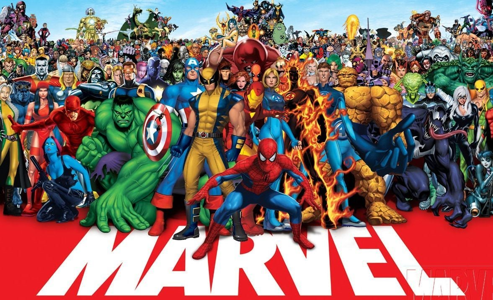

# **Khan Academy Marvel Project**
---

# [Marvel Project](https://www.khanacademy.org/computer-programming/project-marvel/5319572987363328)

Introduction

This project is done in Khan Academy. It shows the SQL queries learned during the first part of this course. 

Topics include:
- Basics of creating tables and selecting data in various different ways.
- Using CREATE TABLE, INSERT INTO, SELECT, FROM, WHERE, and ORDER BY.
-  Learn how to perform more advanced SQL queries using AND/OR, IN, LIKE, HAVING, and more.

Small Projects:

## [Gradebook Using CASE](https://www.khanacademy.org/computer-programming/gradebook-using-case/5852671261327360)

---
## [The Wordiest Author Challenge](https://www.khanacademy.org/computer-programming/the-wordiest-author-challenge/6501241735921664)

---
## [Playlist Maker Using IN](https://www.khanacademy.org/computer-programming/playlist-maker-using-in/5108407183130624)

---
## [Box Office Using WHERE & ORDER BY](https://www.khanacademy.org/computer-programming/box-office-using-where-order-by/6377776404021248)