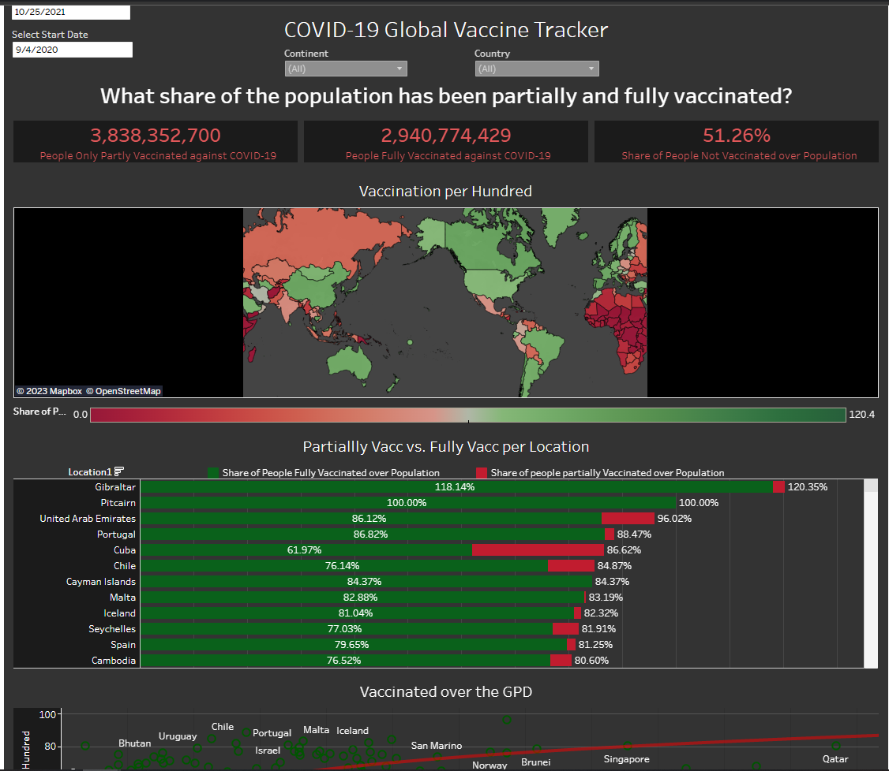

# COVID-19 Global Tracker Dashboard 
***
In this dashboard I wanted to show some Tableau skills that included KPI's, parameters, filter, and creating maps and graphs. I can definitely improve on creating a more appeling dashboard and maybe showing different ways to view the data or answer different questions.  

# [ Tableau link](https://public.tableau.com/app/profile/osvaldo.ibarra/viz/Covid-19Project_16807255654250/GlobalVaccineTracker)

Data Source - [OUR WORLD IN DATA](https://ourworldindata.org/covid-vaccinations)
Walkthrough - [Lore So What](https://www.youtube.com/@loresowhat)